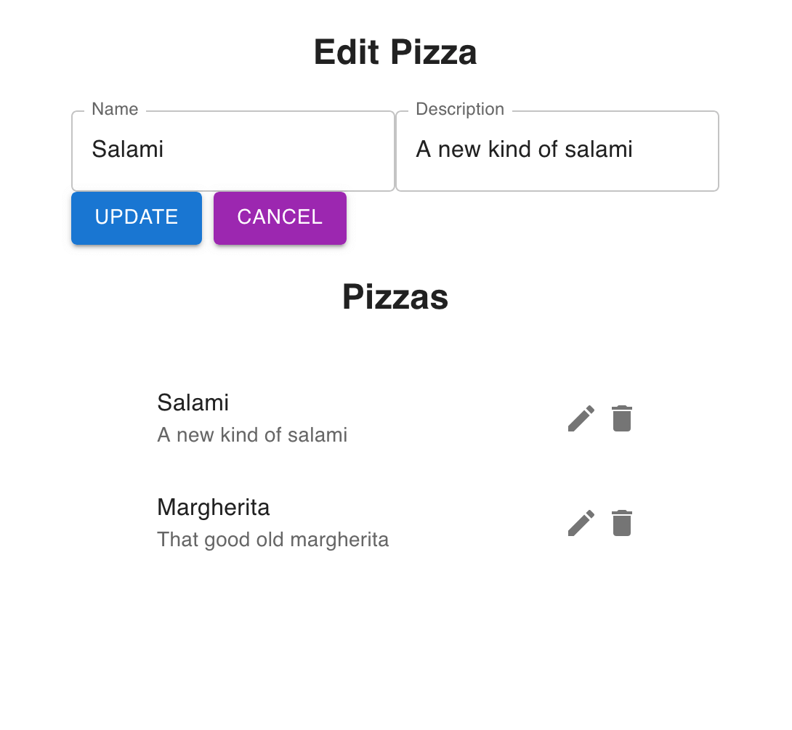

# ASP.NET Core Minimal API Training

This is my code for the [Create web apps and services with ASP.NET Core, minimal API, and .NET](https://learn.microsoft.com/en-us/training/paths/aspnet-core-minimal-api/) training.

It uses [ASP.NET Core Minimal API](https://learn.microsoft.com/en-us/aspnet/core/fundamentals/minimal-apis/overview), [Entity Framework Core](https://learn.microsoft.com/en-us/ef/) with [SQLite](https://sqlite.org/) and [React](https://react.dev/) with [Material UI](https://mui.com/).

## Project structure

This project is divided into 2 parts: 

- The client ([PizzaClient](PizzaClient) folder)
- The API ([PizzaStoreApi](PizzaClient) folder)

On the following sections you will receive instrutions for building each part.

## Requirements

API:

- [.NET 8.0 SDK](https://dotnet.microsoft.com/en-us/download)

Client:

- [Node.js](https://nodejs.org)

## Building

### Client

To build the client you need to open your terminal, go to the `PizzaClient` folder and run `npm install`.

### API

To build the API you need to open your terminal, go to the `PizzaStoreApi` folder and just run `dotnet build`.

Also, you need to create the database, but first you need to install the [Entity Framework Core Tools](https://learn.microsoft.com/en-us/ef/core/cli/dotnet).

To install the `EF Core Tools`, open your terminal and run `dotnet tool install --global dotnet-ef`.

Still on your termial, now go to the `PizzaStoreApi` folder and run `dotnet ef database update`. This command will create the SQLite database named `Pizzas.db` and apply all the necessary scripts into the database.

## Running

### Client

To run the client you need to open your terminal, go to the `PizzaClient` folder and run `npm run dev`.

Now you can open the `http://localhost:3000/` address on your browser.

### API

To run the client you need to open your terminal, go to the `PizzaStoreApi` folder and run `dotnet run`.

Now you can use the client project to access the API.

If you want to inspect the API, open the address `http://localhost:5100/swagger` on your browser.

## Screenshot

